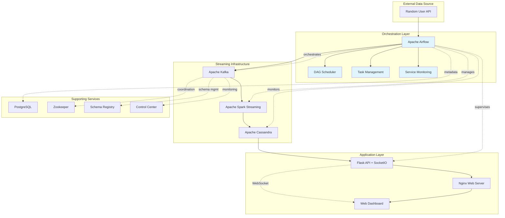

# Real-Time People Dashboard

[](https://www.docker.com/)
[](https://kafka.apache.org/)
[](https://spark.apache.org/)
[](https://cassandra.apache.org/)
[](https://airflow.apache.org/)
[](https://flask.palletsprojects.com/)
[](https://developer.mozilla.org/en-US/docs/Web/JavaScript)
[](https://nginx.org/)

[](https://github.com/yourusername/real-time-people-dashboard)
[](https://docs.docker.com/compose/)
[](https://www.python.org/)
[](LICENSE)
[](https://github.com/yourusername/real-time-people-dashboard)
[](https://socket.io/)

A comprehensive real-time data pipeline that fetches people data from Random User API, processes it through Kafka and Spark, stores in Cassandra, and displays it on a beautiful web dashboard with live updates.

## 🏗️ Architecture Overview



### Technology Stack

| Component | Technology | Purpose |
|-----------|------------|---------|
| **Data Source** | Random User API | Generate realistic user data |
| **Orchestration** | Apache Airflow | Schedule and monitor data workflows |
| **Message Queue** | Apache Kafka | Stream data in real-time |
| **Stream Processing** | Apache Spark | Process and transform streaming data |
| **Database** | Apache Cassandra | Store processed user data |
| **Backend API** | Flask + SocketIO | Serve data and WebSocket connections |
| **Frontend** | Vanilla JavaScript | Real-time dashboard interface |
| **Web Server** | Nginx | Reverse proxy and static file serving |
| **Containerization** | Docker + Docker Compose | Service orchestration |

## 🚀 Quick Start

### Prerequisites


### One-Click Setup

**Development Mode:**
```bash
git clone https://github.com/yourusername/real-time-people-dashboard.git
cd real-time-people-dashboard
./start-dev.sh
```

**Production Mode:**
```bash
./start-prod.sh
```

### Manual Setup
```bash
# Development
docker-compose up --build

# Production
docker-compose -f docker-compose.yml -f docker-compose.prod.yml up --build
```

## 📱 Service Endpoints

| Service | URL | Status | Credentials |
|---------|-----|--------|-------------|
|  | [http://localhost:3000](http://localhost:3000) |  | None |
|  | [http://localhost:8080](http://localhost:8080) |  | admin/admin |
|  | [http://localhost:9021](http://localhost:9021) |  | None |
|  | [http://localhost:5001](http://localhost:5001) |  | None |
|  | [http://localhost:9090](http://localhost:9090) |  | None |

## 🔄 Starting the Data Pipeline

1. **Access Airflow UI**: Navigate to http://localhost:8080
2. **Login**: Use credentials `admin/admin`
3. **Enable DAG**: Toggle ON the "user_automation" DAG
4. **Monitor Pipeline**: Watch real-time data flow in the dashboard

## 🐳 Docker Services


<details>
<summary>Click to expand service details</summary>

| Service | Container | Ports | Health Check |
|---------|-----------|-------|--------------|
|  | `people-frontend` | 3000:80 |  |
|  | `people-backend` | 5001:5001 |  |
|  | `spark-streaming` | - |  |
|  | `cassandra` | 9042:9042 |  |
|  | `broker` | 9092:9092 |  |
|  | `zookeeper` | 2181:2181 |  |
|  | `airflow-webserver` | 8080:8080 |  |
|  | `airflow-scheduler` | - |  |
|  | `postgres` | 5432:5432 |  |
|  | `spark-master` | 9090:8080 |  |
|  | `spark-worker` | - |  |
|  | `schema-registry` | 8081:8081 |  |
|  | `control-center` | 9021:9021 |  |

</details>

## 🛠️ Development

### Project Structure
```
real-time-pipeline/
├── frontend/                 # Nginx + Vanilla JS frontend
│   ├── Dockerfile           # Frontend container config
│   ├── nginx.conf           # Nginx reverse proxy config
│   ├── index.html           # Dashboard HTML
│   └── app.js              # Frontend JavaScript logic
├── backend/                 # Flask backend with WebSocket
│   ├── Dockerfile          # Backend container config
│   ├── requirements.txt    # Python dependencies
│   └── app.py             # Flask API + SocketIO server
├── spark-docker/           # Spark streaming processor
│   ├── Dockerfile         # Spark container config
│   └── spark_stream.py    # Spark streaming logic
├── dags/                   # Airflow DAGs
│   └── kafka_stream.py    # Data generation DAG
├── script/                 # Utility scripts
│   └── entrypoint.sh      # Airflow initialization
├── docker-compose.yml      # Main services definition
├── docker-compose.prod.yml # Production overrides
├── docker-compose.override.yml # Development overrides
├── start-dev.sh           # Development startup script
├── start-prod.sh          # Production startup script
└── requirements.txt       # Global Python requirements
```

### Environment Configuration

Create `.env` file for custom configuration:

```env
# Database
CASSANDRA_HOST=cassandra
CASSANDRA_PORT=9042

# Kafka
KAFKA_BOOTSTRAP_SERVERS=broker:29092
KAFKA_TOPIC=users_created

# Backend
BACKEND_PORT=5001
FLASK_ENV=development
DEBUG=true

# Frontend
FRONTEND_PORT=3000

# Spark
SPARK_MASTER_URL=spark://spark-master:7077
```

### API Endpoints


| Method | Endpoint | Description | Response |
|--------|----------|-------------|----------|
|  | `/api/people` | Fetch all people records | JSON array of people |
|  | `/socket.io/` | Real-time updates | Live person data |

**Example Response:**
```json
[
  {
    "id": "123e4567-e89b-12d3-a456-426614174000",
    "first_name": "John",
    "last_name": "Doe",
    "email": "john.doe@example.com",
    "phone": "+1-555-123-4567",
    "address": "123 Main St, Anytown, USA",
    "gender": "male",
    "picture": "https://randomuser.me/api/portraits/men/1.jpg",
    "registered_date": "2023-12-01T10:30:00Z"
  }
]
```

## 🔍 Monitoring & Debugging

### Real-time Monitoring


```bash
# View all service logs
docker-compose logs -f

# Monitor specific services
docker-compose logs -f people-backend
docker-compose logs -f spark-streaming
docker-compose logs -f broker

# Check service status
docker-compose ps
```

### Health Checks


```bash
# Frontend health
curl http://localhost:3000/health

# Backend health
curl http://localhost:5001/api/people

# Cassandra health
docker exec cassandra cqlsh -e "DESCRIBE KEYSPACES"
```

### Database Operations

```bash
# Connect to Cassandra
docker exec -it cassandra cqlsh

# View data
USE spark_streams;
SELECT COUNT(*) FROM created_users;
SELECT * FROM created_users LIMIT 5;

# Monitor real-time inserts
SELECT * FROM created_users WHERE registered_date > '2023-12-01' ALLOW FILTERING;
```

### Kafka Debugging

```bash
# List topics
docker exec broker kafka-topics --bootstrap-server localhost:9092 --list

# Monitor messages
docker exec broker kafka-console-consumer \
  --bootstrap-server localhost:9092 \
  --topic users_created \
  --from-beginning \
  --max-messages 5
```

## 🚨 Troubleshooting

### Common Issues

<details>
<summary>🔧 Service Startup Issues</summary>

**Problem**: Services fail to start or crash immediately

**Solutions**:
```bash
# Check available memory
free -h

# Increase Docker memory allocation (8GB+ recommended)
# Docker Desktop: Settings > Resources > Memory

# Restart with clean state
docker-compose down -v
docker system prune -f
./start-dev.sh
```
</details>

<details>
<summary>🔌 Port Conflicts</summary>

**Problem**: Port already in use errors

**Solutions**:
```bash
# Check port usage
sudo lsof -i :3000
sudo lsof -i :8080
sudo lsof -i :9092

# Kill conflicting processes
sudo kill -9 $(lsof -t -i:3000)

# Use different ports in docker-compose.yml
```
</details>

<details>
<summary>📊 No Data Flowing</summary>

**Problem**: Dashboard shows no data or updates

**Checklist**:
- [ ] Airflow DAG enabled and running
- [ ] Kafka receiving messages
- [ ] Spark streaming job active
- [ ] Cassandra connection established
- [ ] Backend API responding

```bash
# Verify data flow
docker exec broker kafka-console-consumer --bootstrap-server localhost:9092 --topic users_created --max-messages 1
docker exec cassandra cqlsh -e "SELECT COUNT(*) FROM spark_streams.created_users;"
curl http://localhost:5001/api/people | jq length
```
</details>

<details>
<summary>🌐 Frontend Connection Issues</summary>

**Problem**: Dashboard can't connect to backend

**Solutions**:
```bash
# Check backend status
curl http://localhost:5001/api/people

# Verify WebSocket connection
curl -H "Connection: Upgrade" -H "Upgrade: websocket" http://localhost:5001/socket.io/

# Check browser console for CORS errors
# Ensure backend CORS is configured properly
```
</details>

## 📊 Features

### Real-Time Dashboard
- 
- 
- 
- 
- 
- 

### Data Pipeline
- 
- 
- 
- 
- 

### Production Ready
- 
- 
- 
- 
- 
- 

## 🔒 Security Considerations

### Current Security Features
- 
- 
- 
- 

### Production Security Recommendations
- [ ] Change default passwords in production
- [ ] Implement SSL/TLS certificates
- [ ] Add authentication and authorization
- [ ] Enable Kafka security features
- [ ] Implement rate limiting
- [ ] Add input validation and sanitization
- [ ] Set up monitoring and alerting
- [ ] Regular security updates

## 📈 Performance & Scaling

### Current Performance
- 
- 
- 
- 

### Scaling Options

**Horizontal Scaling:**
- Add more Spark workers
- Scale Kafka partitions
- Deploy Cassandra cluster
- Load balance frontend instances

**Vertical Scaling:**
- Increase container memory limits
- Optimize Spark configurations
- Database query optimization
- Implement caching layer

### Performance Tuning

```yaml
# docker-compose.yml - Memory allocation example
services:
  spark-streaming:
    deploy:
      resources:
        limits:
          memory: 4G
        reservations:
          memory: 2G
```

## 🧪 Testing

### Manual Testing
```bash
# Test data generation
curl -X POST http://localhost:8080/api/v1/dags/user_automation/dagRuns \
  -H "Content-Type: application/json" \
  -u admin:admin

# Test backend API
curl http://localhost:5001/api/people | jq '.[0]'

# Test WebSocket connection
wscat -c ws://localhost:5001/socket.io/
```

### Load Testing
```bash
# Install dependencies
pip install locust

# Run load test
locust -f tests/load_test.py --host=http://localhost:5001
```

## 🤝 Contributing


1. **Fork the repository**
2. **Create feature branch**: `git checkout -b feature/amazing-feature`
3. **Make changes and test thoroughly**
4. **Commit changes**: `git commit -m 'Add amazing feature'`
5. **Push to branch**: `git push origin feature/amazing-feature`
6. **Open Pull Request**

---

<div align="center">


</div>
